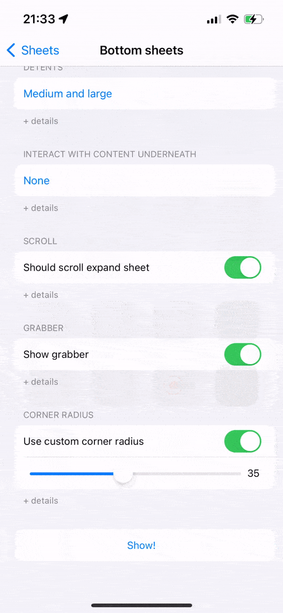

# BottomSheet

Bring to SwiftUI the UIKit bottom sheet capabilities that came with iOS15.

## Usage

#### Show the bottom sheet

``` swift
Button(action: { show.toggle() }) {
    Text("Show!")
}
.bottomSheet(
    isPresented: $show,
    detents: [.fixed(100), .medium, .ratio(0.75)],
    shouldScrollExpandSheet: true,
    largestUndimmedDetent: [.medium],
    showGrabber: true,
    cornerRadius: 40,
    showsInCompactHeight: true,
    dismissable: true
) {
    List {
        Section {
            ForEach(0..<50, id: \.self) { id in
                Text("Item \(id)")
            }
        } header: {
            Text("Look at that bottom sheet!!")
        }
    }
}
```

#### Dismiss

``` swift
Button(action: { BottomSheet.dismiss() }) {
    Label("Dismiss", systemImage: "multiply")
}
```

#### Fixed ColorScheme

If you are using a fixed color scheme for your app or a specific view, by using the `.preferredColorScheme(.light)` modifier, you may also want to specify that to the bottom sheet.
To do so, use the parameter `preferredColorScheme` on the `bottomSheet(...)` modifier.

## Preview



## Sources

Inspired by Sarun W.'s article ["How to present a Bottom Sheet in iOS 15 with UISheetPresentationController"](https://sarunw.com/posts/bottom-sheet-in-ios-15-with-uisheetpresentationcontroller/).
